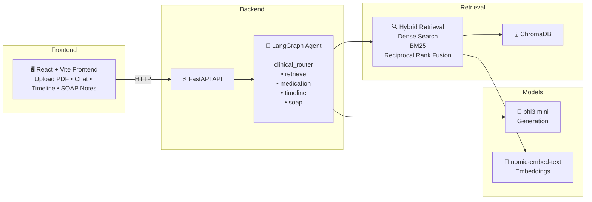
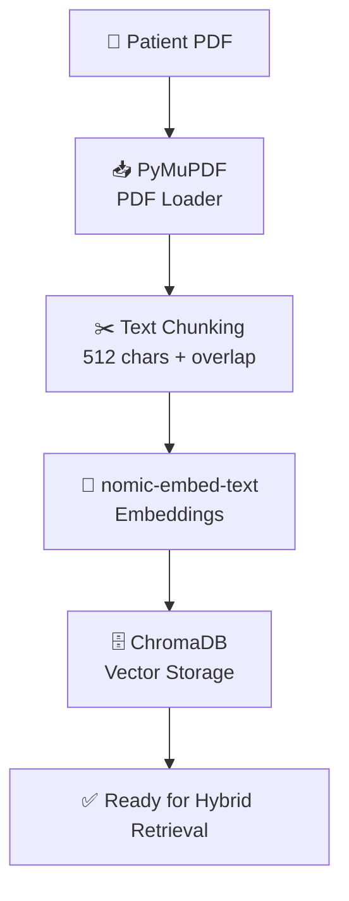
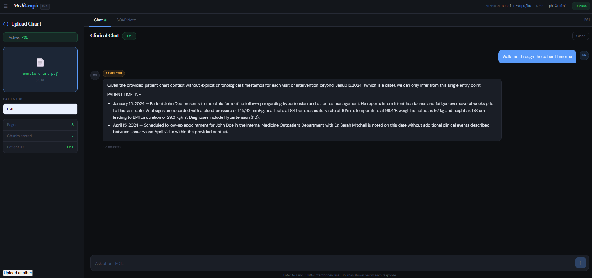

# MediGraph-RAG

A locally-running agentic RAG system for clinical chart analysis.
Upload a patient PDF, ask physician-style questions, extract medications,
build patient timelines, and generate SOAP notes — all powered by Ollama
running entirely on your own machine.

> ⚠️ Research and educational use only.
> Not FDA-approved medical software. Do not use for clinical decision-making.
> If LangSmith tracing is enabled, metadata may be sent to LangSmith cloud.

## Design Decisions

**Why LangGraph over plain LangChain chains?**  
LangGraph models the agent as an explicit directed graph — every node is a testable pure function, every edge is auditable. Adding a new tool is adding a node and a conditional edge, not restructuring a monolithic chain. Nodes are inspectable via LangSmith.

**Why Ollama-first?**  
All inference runs locally — no patient data leaves the machine, no API keys, no rate limits. `phi3:mini` (2.2 GB) runs on 8 GB RAM.

**Why hybrid retrieval (dense + BM25 + RRF)?**  
Pure vector search fails on exact-match clinical queries — `"What is the Metformin dosage?"` can return semantically similar chunks that don't contain the word *Metformin*. BM25 fills that gap. Reciprocal Rank Fusion merges the two ranked lists without requiring weight tuning and is robust to scale differences between cosine similarity and BM25 scores.

**Why RRF over weighted score fusion?**  
Cosine similarity and BM25 scores aren't on the same scale — you can't add them directly. RRF uses only rank order (`1 / (rank + 60)`), making it scale-invariant and parameter-free.

## Architecture


### System Architecture



### Document Ingestion Pipeline



## What it does

- Upload patient charts
- Answer clinical questions
- Extract medications
- Build patient timelines
- Generate SOAP notes
- Multi-turn memory
- RAGAS evaluation
- Optional LangSmith tracing

## Quickstart


### Prerequisites

| Tool | Version | Install |
|---|---|---|
| Python | 3.11+ | [python.org](https://python.org) |
| Node.js | 20+ | [nodejs.org](https://nodejs.org) |
| Ollama | 0.1.30+ | [ollama.ai](https://ollama.ai) |
| Docker | 20+ | [docker.com](https://docker.com) (optional) |

---

### 1. Clone and set up

```bash
git clone https://github.com/Vee27/MediGraph-RAG.git
cd MediGraph-RAG

python -m venv .venv
source .venv/Scripts/activate      # Windows Git Bash
# source .venv/bin/activate        # macOS / Linux

pip install -r requirements.txt
```

### 2. Configure environment

```bash
cp .env.example .env
```

### 3. Pull Ollama models

```bash
ollama pull phi3:mini          # ~2.2 GB
ollama pull nomic-embed-text   # ~274 MB
```

### 4. Verify installation

```bash
# Terminal 1 — start Ollama
ollama serve

# Terminal 2 — start FastAPI
uvicorn app.main:app --reload
```

Hit the health endpoint:

```bash
curl http://localhost:8000/health
```

Expected response:

```json
{
  "status": "ok",
  "ollama_reachable": true,
  "model": "phi3:mini"
}
```

If `ollama_reachable` is `false`, make sure `ollama serve` is running in another terminal.

### 5. Start the frontend

```bash
# Terminal 3
cd frontend
npm install
npm run dev
```

Open `http://localhost:5173` in your browser. 

### 6. Run with Docker (alternative)

```bash
make docker-up
```

Services start on the same ports. To stop: `make docker-down`.

---

## Frontend ↔ Backend connection

The React frontend talks to FastAPI via a **Vite proxy** — no environment
variable or CORS configuration is needed during local development.

In `frontend/vite.config.js`:

```js
server: {
  proxy: {
    '/api': {
      target: 'http://localhost:8000',
      changeOrigin: true,
      rewrite: (path) => path.replace(/^\/api/, ''),
    },
  },
}
```

All `axios` calls in `src/api/client.js` use `/api` as the base URL.
Vite rewrites them to `http://localhost:8000` transparently. No
`VITE_API_URL` env var is needed in development.

For production builds, set up a reverse proxy (nginx, Caddy) to forward
`/api` to the FastAPI container, or set `VITE_API_URL` in a production
`.env.production` file.

---


## Example workflow

1. Upload a patient chart PDF through the web interface.
2. Ask clinical questions about medications, diagnoses, or lab values.
3. Generate a patient timeline.
4. Create a SOAP note.
5. Continue the conversation using session memory.

Example questions:

- What medications is the patient taking?
- What were the patient's most recent vital signs?
- Build a timeline of clinical events.
- Generate a SOAP note for this encounter.

See `docs/api_examples.md` for REST API examples.

## Demo



## Performance benchmarks

Measured on Windows 11, Intel Core i7, 16 GB RAM, Ollama running locally
with `phi3:mini`. Numbers will vary by hardware.

| Metric | Value |
|---|---|
| PDF indexing (3-page chart) | ~45 seconds |
| Embedding per chunk | ~1.2 seconds |
| Retrieval latency (hybrid search) | ~2 seconds |
| Chat response — retrieve intent | ~12–18 seconds |
| Chat response — SOAP note | ~25–35 seconds |
| Chunk size | 512 characters |
| Chunk overlap | 64 characters |
| Top-k retrieval (dense) | 10 candidates |
| Top-k after RRF reranking | 5 results |

phi3:mini is chosen for low RAM usage (~2.2 GB). Swap for `llama3.1:8b`
on machines with 16 GB+ RAM for meaningfully better output quality.

---

## Evaluation

The project includes a RAGAS evaluation suite built on a synthetic clinical dataset.

Metrics tracked:

- Faithfulness
- Answer Relevancy

Run:

```bash
make eval
```

See `docs/evaluation.md` for methodology and benchmark details.

## License

MIT License. See LICENSE for details.
